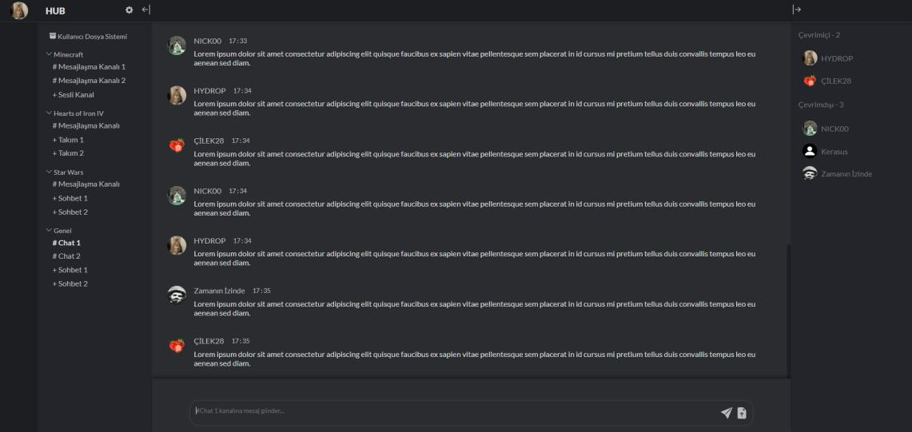
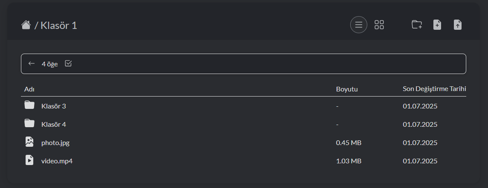
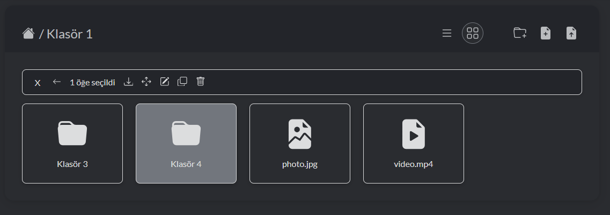
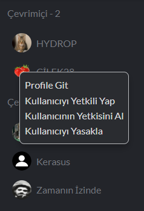
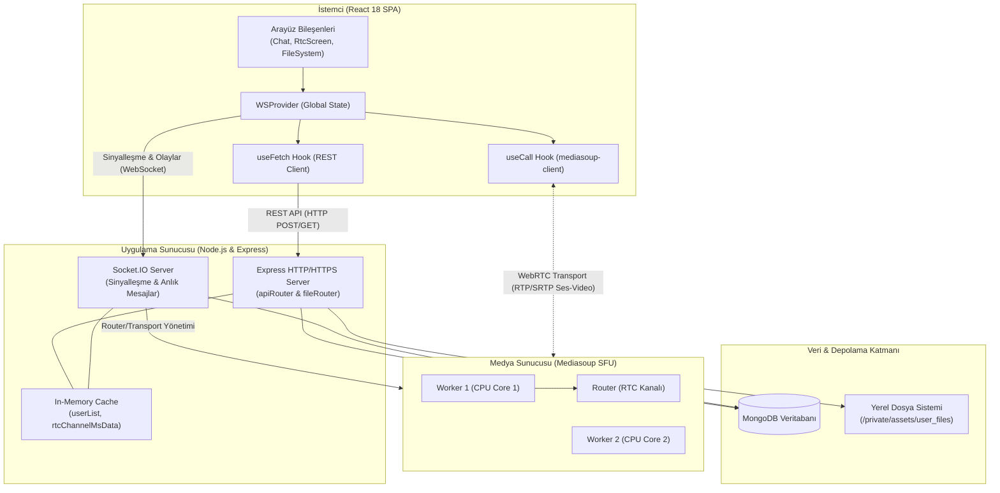

<div align="center">

# 🌐 BAND (Band Absolutely Not Discord)

**Kişisel Barındırmalı (Self-Hosted), Güvenli ve Gerçek Zamanlı Topluluk İletişim Platformu**


[](https://react.dev/)
[](https://vitejs.dev/)
[](https://www.mongodb.com/)
[](https://socket.io/)
[](https://mediasoup.org/)
[](LICENSE)

<p align="center">
  <a href="#-hızlı-başlangıç-quickstart">Hızlı Başlangıç</a> •
  <a href="#-öne-çıkan-özellikler-key-features">Özellikler</a> •
  <a href="#-teknoloji-yığını-tech-stack">Teknoloji Yığını</a> •
  <a href="#-mimari-ve-sistem-tasarımı-architecture">Mimari</a> •
  <a href="#-dizin-yapısı-project-structure">Dizin Yapısı</a> •
  <a href="#-lisans-license">Lisans</a>
</p>

---

### 🖥️ Uygulama Arayüzü

<p align="center">
  
  <br>
  <em>BAND Ana Sohbet Arayüzü, Kanallar ve Çevrimiçi Kullanıcı Listesi</em>
</p>

---

</div>

## 📖 Proje Hakkında

Günümüzde yaygın kullanılan merkezi iletişim platformları (Discord, Slack, Teams vb.), kullanıcı verilerini kendi merkezi sunucularında toplayarak veri mahremiyeti ve gözetim riskleri doğurmakta; aynı zamanda harici sansür ve kısıtlamalara açık hale gelmektedir.

**BAND (Band Absolutely Not Discord)**; bu sorunlara pratik bir çözüm getirmek amacıyla geliştirilmiş, **açık kaynak kodlu ve kişisel barındırmalı (self-hosted)** bir iletişim platformudur. BAND sayesinde kullanıcılar ve topluluklar kendi bağımsız sunucularını (Hub) kurabilir; metin sohbeti, düşük gecikmeli sesli/görüntülü yayın ve kişisel bulut dosya yönetimi üzerinde **%100 veri egemenliği** elde ederler.

---

## ✨ Öne Çıkan Özellikler (Key Features)

- **💬 Gerçek Zamanlı Metin Sohbeti:**
  - Socket.IO oda (room) yapısıyla anlık mesajlaşma.
  - Dinamik regex tabanlı tıklanabilir bağlantı tanıma (URL detection).
  - Yukarı kaydırmayla otomatik eski mesajları yükleme (Infinite Scroll).
  - Çoklu dosya eki gönderimi ve bağımsız mesaj blokları.

- **🎙️ Yüksek Performanslı SFU Tabanlı RTC (Ses, Kamera & Ekran Paylaşımı):**
  - **Mediasoup v3 SFU** mimarisi sayesinde her katılımcının akışını sunucuda birleştirmeden (MCU yükü olmadan) ve istemcileri boğmadan (P2P Mesh darboğazı olmadan) düşük bant genişliğiyle yönlendirme.
  - Çok çekirdekli (Multi-core) CPU Worker ve Router havuzu.
  - Tarayıcı standart Web API'leri (`getUserMedia`, `getDisplayMedia`) ile doğrudan donanım entegrasyonu.
  - **Sürüklenebilir Yerel Önizleme (Self-View):** Kullanıcının kendi kamerasını veya ekran yayınını ekranın istenilen yerine sürükleyip bırakabildiği esnek önizleme penceresi.


- **📁 Entegre Kişisel Bulut Dosya Sistemi (Cloud Storage):**
  - Google Drive benzeri kullanıcıya özel izole depolama alanı (`/private/assets/user_files/:userId`).
  - Hiyerarşik klasör ve dosya yapısı (MongoDB düğüm/node yaklaşımı).
  - Dosya/Klasör oluşturma, yeniden adlandırma, taşıma, kopyalama ve özyineli (recursive) silme.
  - Seçilen çoklu dosya ve klasörleri `archiver` kütüphanesi ile anında **ZIP olarak tek tıkla toplu indirme**.
  - Liste ve Izgara (Grid) görünümleri arasında geçiş, dosya uzantısına göre dinamik SVG ikon desteği.

<p align="center">
  
  &nbsp;
  
  <br>
  <em>Kişisel Bulut Dosya Sistemi: Liste ve Izgara (Grid) Görünümü</em>
</p>

- **🛡️ Sunucu Yapılandırması ve Sağ Tık Moderasyon:**
  - Kategori ve kanal oluşturma, düzenleme, silme ve anlık WebSocket senkronizasyonu (`emitHubSections`).
  - Kullanıcı listesi üzerinden sağ tık **Context Menu** ile anlık yetkilendirme (Admin yapma/yetki alma) ve sunucudan uzaklaştırma (Ban).
  - İsteğe bağlı davet kodu (Invite link) sistemi veya herkese açık kayıt (Open Registration) modu.

<p align="center">
  
  <br>
  <em>Bağlama Duyarlı Sağ Tık Moderasyon ve Profil Menüsü</em>
</p>

- **🔒 Kurumsal Seviye Güvenlik:**
  - **Argon2** parola hashleme algoritması (GPU ve kaba kuvvet saldırılarına karşı azami direnç).
  - Durumsuz (stateless) **JSON Web Token (JWT)** ile oturum yönetimi.
  - `@dr.pogodin/csurf` ile otomatik **CSRF (Cross-Site Request Forgery)** koruması.
  - Sunucu içi hızlı bellek önbelleği (`Map` in-memory user list) ile optimize edilmiş veritabanı erişimi.

---

## 🛠️ Teknoloji Yığını (Tech Stack)

| Katman / Alan | Teknoloji & Kütüphaneler | Açıklama / Rol |
| :--- | :--- | :--- |
| **Frontend UI** | [React 18](https://react.dev/) | Bileşen tabanlı Tek Sayfa Uygulaması (SPA) |
| **Build Aracı** | [Vite 6](https://vitejs.dev/) | Hızlı Hot Module Replacement (HMR) ve optimize derleme |
| **State Yönetimi** | React Context API (`WSProvider`) | Global soket, medya ve oturum durumu yönetimi |
| **Medya İstemcisi** | [mediasoup-client](https://mediasoup.org/) | WebRTC transport, producer/consumer soyutlaması |
| **Backend Runtime** | Node.js (ES Modules) | Asenkron, engellemeyen G/Ç (Non-blocking I/O) sunucu ortamı |
| **Web Çatısı** | [Express.js 5](https://expressjs.com/) | RESTful API yönlendirme, middleware katmanları |
| **Gerçek Zamanlı İletişim** | [Socket.IO 4](https://socket.io/) | Çift yönlü WebSocket olay iletimi ve sinyalleşme |
| **Medya Sunucusu (SFU)** | [Mediasoup 3](https://mediasoup.org/) | C++ çekirdekli çok kanallı WebRTC SFU yönlendiricisi |
| **Veritabanı** | [MongoDB](https://www.mongodb.com/) & [Mongoose 8](https://mongoosejs.com/) | Doküman tabanlı NoSQL veritabanı ve esnek şema modelleme |
| **Güvenlik** | `argon2`, `jsonwebtoken`, `@dr.pogodin/csurf` | Parola güvenliği, JWT kimlik doğrulama, CSRF kalkanı |
| **Dosya & Arşivleme** | `multer`, `archiver` | Hibrit dosya yükleme ve özyineli ZIP sıkıştırma |

---

## 🏛️ Mimari ve Sistem Tasarımı (Architecture)

Aşağıdaki şema, istemci ile sunucu arasındaki hibrit REST, WebSocket ve Mediasoup SFU boru hattını özetlemektedir:



> **Hibrit Dosya İletim Stratejisi:**  
> Büyük ikili (binary) veriler WebSocket kanalını tıkamamak için **HTTP POST** üzerinden `multer` ile yüklenir. Yükleme tamamlandığında dosya meta verisi WebSocket `newMessageFromClient` olayı ile kanala bildirilir ve istemcilere anında yansıtılır.

---

## 🚀 Hızlı Başlangıç (Quickstart & Setup)

BAND'i kendi yerel makinenizde veya sunucunuzda çalıştırmak için aşağıdaki adımları izleyin.

### 📋 Ön Gereksinimler

- **Node.js:** v18.0.0 veya üzeri
- **NPM:** v9.0.0 veya üzeri
- **MongoDB:** v6.0 veya üzeri (Yerel servis veya MongoDB Atlas URI)
- **Git:** Sürüm kontrol aracı
- **C++ Derleme Araçları:** Mediasoup derlemesi için işletim sisteminize göre Python 3 ve C/C++ derleyicisi (Linux için `build-essential`, macOS için Xcode CLI, Windows için Visual Studio C++ Build Tools).

---

### 📥 1. Depoyu Klonlayın

```bash
git clone https://github.com/kullanici-adi/BAND.git
cd BAND
```

---

### ⚙️ 2. Arka Yüz (Backend) Kurulumu

1. Sunucu dizinine geçin ve bağımlılıkları yükleyin:
   ```bash
   cd backend/server
   npm install
   ```

2. Yapılandırma ayarlarını kontrol edin:
   `backend/server/config.js` dosyasını açarak ortamınıza göre düzenleyin:
   ```javascript
   const config = {
     server: {
       http: {
         ip: "localhost",
         port: 3000,
         status: true,
       },
       https: {
         status: false, // Üretim ortamında SSL aktif edilebilir
         privateKey: { location: "./localhost-key.pem" },
         certificate: { location: "./localhost.pem" },
       },
       settings: {
         registration: {
           type: "openRegistiration", // 'openRegistiration' veya 'inviteOnly'
         },
         rateLimit: {
           status: false,
         },
         userFileSystem: {
           status: true,
           storageLimit: 2 * 1024 * 1024 * 1024, // Kullanıcı başı 2 GB kota
         },
       },
     },
     database: {
       url: "mongodb://localhost:27017/bandDB", // MongoDB bağlantı adresiniz
     },
     jwt: {
       secret: "super_secret_jwt_key_degistirin", // Güçlü bir anahtar belirleyin
       expires: "2d",
     },
   };

   export default config;
   ```

3. Backend sunucusunu başlatın:
   ```bash
   npm start
   # Sunucu varsayılan olarak http://localhost:3000 üzerinde dinlemeye başlar.
   ```

---

### 💻 3. Ön Yüz (Frontend) Kurulumu

Yeni bir terminal açın ve istemci projesini başlatın:

```bash
cd frontend/band
npm install
npm run dev
```

Vite geliştirme sunucusu varsayılan olarak **`http://localhost:5173`** adresinde açılacaktır. Tarayıcınızdan bu adrese giderek ilk hesabınızı oluşturabilirsiniz!

---

## 🏭 Üretim Dağıtımı (Production Deployment)

Uygulamanın canlı sunucuda kararlı ve yüksek performanslı çalışması için önerilen dağıtım adımları:

1. **İstemciyi Derleyin:**
   ```bash
   cd frontend/band
   npm run build
   # Derlenen statik dosyalar 'frontend/band/dist' klasörüne aktarılır.
   ```

2. **PM2 ile Süreç Yönetimi:**
   Sunucu tarafının arka planda kalıcı çalışması ve çökmelere karşı yeniden başlatılması için [PM2](https://pm2.keymetrics.io/) kullanın:
   ```bash
   cd backend/server
   npm install -g pm2
   pm2 start server.js --name "band-backend"
   pm2 save
   ```

3. **Ters Proxy (Reverse Proxy & SSL):**  
   Nginx kullanarak istemci statik dosyalarını sunabilir, `/api`, `/file` ve `/socket.io` isteklerini `http://localhost:3000` portuna yönlendirebilir ve Let's Encrypt ile ücretsiz SSL/TLS sertifikası tanımlayabilirsiniz.

---

## 📂 Dizin Yapısı (Project Structure)

```text
BAND/
├── backend/
│   └── server/
│       ├── models/              # Mongoose şemaları (User, Profile, Channel, File, Message...)
│       ├── Routers/
│       │   ├── apiRouter.js     # Kimlik doğrulama, hub ayarları ve moderasyon rotaları
│       │   └── fileRouter.js    # Multer dosya yükleme, klasör CRUD ve ZIP akış rotaları
│       ├── config.js            # Sunucu, JWT, veritabanı ve kotaların yapılandırması
│       ├── media.js             # Mediasoup Worker, Router ve Transport orkestrasyonu
│       ├── mongo.js             # Veritabanı bağlantısı ve yardımcı DB fonksiyonları
│       ├── utils.js             # Hub bölümleri ve bildirim yayma yardımcıları
│       ├── server.js            # Express & Socket.IO ana giriş noktası
│       └── package.json
│
├── frontend/
│   └── band/
│       ├── src/
│       │   ├── Components/      # Modüler React UI bileşenleri
│       │   │   ├── Chat/        # Sohbet akışı (Feed, Message, MessageFile, ChatBox)
│       │   │   ├── Hub/         # Sunucu yönetimi, kanallar ve ayar modalları
│       │   │   ├── RTC/         # Video ızgarası, ekran paylaşımı ve akış satırları
│       │   │   ├── UI/          # Sürüklenebilir öğeler, context menü ve pencereler
│       │   │   └── UserFileSystem/ # Kişisel dosya yöneticisi (Liste/Izgara, Gezinme)
│       │   ├── Contexts/
│       │   │   └── WSProvider.jsx # WebSocket, oturum ve medya merkezi state yöneticisi
│       │   ├── hooks/           # Özel React Hook'ları (useCall, useFetch, useWait)
│       │   ├── App.jsx          # Ana kök bileşen ve yetki yönlendirmesi
│       │   └── main.jsx         # Vite DOM başlangıç noktası
│       ├── vite.config.js
│       └── package.json
│
├── docs/
│   └── screenshots/             # Tezinizden çıkarılan orijinal arayüz ekran görüntüleri
│       ├── chat_interface.jpg
│       ├── file_system_list.png
│       ├── file_system_grid.png
│       └── context_menu.png
│
└── README.md
```

---

## 🔍 Detaylı API ve Olay Referansı (Deep Dive)

<details>
<summary><b>📡 REST API Uç Noktaları (Tıklayıp Genişletin)</b></summary>

### `/api` Yolu (apiRouter)
- `POST /api/login` - Kullanıcı adı ve parola doğrulaması, JWT üretimi.
- `POST /api/signup` - Yeni kullanıcı kaydı (Açık kayıt veya davet token doğrulamalı).
- `GET /api/session-check` - İstemci çerezindeki oturumun geçerlilik kontrolü.
- `GET /api/log-out` - Oturumu sonlandırma ve çerez temizleme.
- `GET /api/get-csrf` - Form gönderimleri için CSRF koruma token'ı temini.
- `POST /api/get-messages` - Kanal geçmişine ait mesajları sayfalama (pagination) ile alma.
- `POST /api/set-hub-settings` - Yönetici işlemleri:
  - `add-channel` / `edit-category` / `remove-channel`
  - `ban-client` (Kullanıcı uzaklaştırma)
  - `admin-client` / `no-admin-client` (Yetki düzenleme)
- `POST /api/set-user-settings` - Profil fotoğrafı, banner ve bio güncellemesi.
- `POST /api/create-invite-link` - Yönetici tarafından süreli/kullanım kotalı davet bağlantısı oluşturma.

### `/file` Yolu (fileRouter)
- `POST /file/send-file` - `multer` ile dosya yükleme (chat, profile veya user-file-system).
- `POST /file/user-file-system` - Dosya sistemi operasyonları:
  - `starting-check`, `get-directory`, `create-file`, `rename-file`, `delete-file`, `move-file`, `copy-file`, `download-file` (ZIP çıktısı).
- `GET /file/file-system/get-file/:id` - Dosya sisteminden tekil dosya akışı/indirmesi.
</details>

<details>
<summary><b>⚡ WebSocket (Socket.IO) ve Mediasoup Olayları (Tıklayıp Genişletin)</b></summary>

### Temel Soket Olayları
- `joinChannel` / `leaveChannel` - Belirtilen metin veya RTC odasına katılma/ayrılma.
- `newMessageFromClient` - İstemciden metin ve dosya referanslı mesaj gönderimi.
- `newMessageFromServer` - Sunucu tarafından kanaldaki tüm istemcilere mesaj dağıtımı.
- `userList` - Çevrimiçi/çevrimdışı kullanıcı listesindeki değişimlerin yayını.
- `sectionList` - Kategori ve kanal güncellemelerinin tüm istemcilere anlık bildirimi.

### Mediasoup RTC Sinyalleşme Olayları (`msServer`)
- `getRtpCap` - Odanın RTP yeteneklerini (kodekler vb.) sorgulama.
- `create-producer-transport` - Medya göndermek (kamera/mikrofon/ekran) için taşıyıcı oluşturma.
- `create-consumer-transport` - Medya almak için taşıyıcı oluşturma.
- `connect-transport` - İstemci ve sunucu WebRTC transport el sıkışması (DTLS).
- `start-producing` - Sunucuda producer başlatma.
- `consume-media` - Odadaki mevcut veya yeni katılan bir yayıncıyı tüketme (dinleme/izleme).
- `close-transports` / `close-producer` - Yayından ayrılma ve kaynakları serbest bırakma.
</details>

---

## 📜 Lisans (License)

Bu proje [MIT Lisansı](LICENSE) kapsamında lisanslanmıştır. Dilediğiniz gibi kişisel sunucularınızda barındırabilir, değiştirebilir ve açık kaynak topluluğuna katkıda bulunabilirsiniz.

---

<div align="center">
  <sub>BAND - Kişisel Barındırmalı Güvenli Topluluk İletişim Platformu</sub>
</div>
